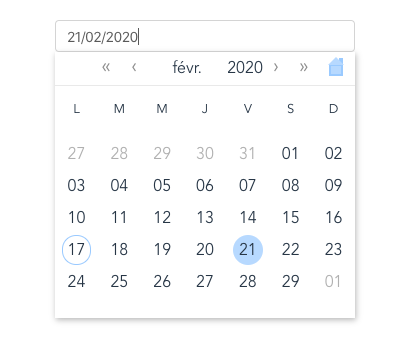
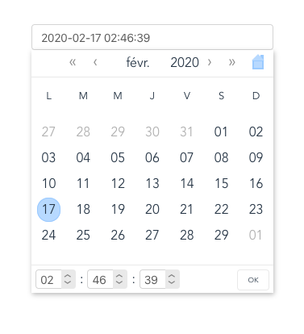
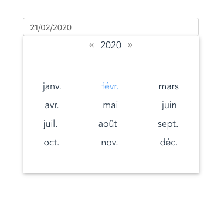
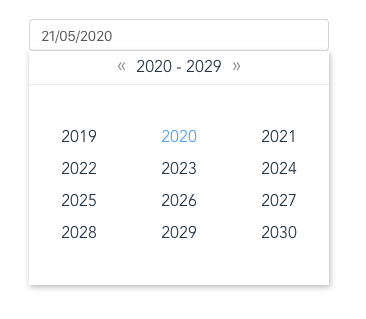

# space-datetime-picker

## Installation setup
```
npm install --save @spacepatate/vue-space-datetime-picker
```
or 

```
yarn add @spacepatate/vue-space-datetime-picker
```

## Register

```
import VueSpaceDatetimePicker from '@spacepatate/vue-space-datetime-picker';
import '@spacepatate/vue-space-datetime-picker/dist/vue-space-datetime-picker.css';

export default {
  name: 'App',
  components: {
    VueSpaceDatetimePicker,
  },

```
## Usage

### Minimal

```
<space-datetime-picker v-model="date"></space-datetime-picker>
```



#### With time


#### Select months


#### Select year



### Parameters

Parameter | Type | Default | Description
--------- | ---- | ------- | -----------
v-model (*required*) | Date `Date` | - | Date object
placeholder | `String` | `''` | placeholder for default input field
format | `String` | `''` | format to display in default input field, the default display format is YYYY-MM-DD
locale | `String` | `undefined` | BCP47 locales, ex: fr-FR, en-BR, en-US...
showTime | `Boolean` | `false` | show time input in date picker
hour12 | `Boolean` | `false` | show time in 12 hours format
weekday | `String` | `narrow` | display week day in long | short | narrow
showHome | `Boolean` | `false` | home icon button allow to return back to current datetime
disabled | `Boolean` | `false` | disabled all inputs
stardingDay | `Number` | `1` | define the first day of week, 0 is sunday, 1 for monday...

### Display format

A valid datetime format is combinated of 'YYYY', 'MM', 'DD' for date and 'HH', 'mm', 'ss' for a valid time

for example MM/DD/YYYY HH:mm:ss is valid for dates like 02/18/2020 00:30:30

### Default slot

A default slot is available to replace the default input field

```
<vue-space-datetime-picker v-model="date">
  <div>custom input</div>
</vue-space-datetime-picker>
```
